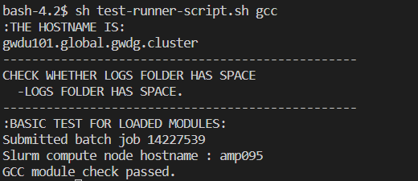

# Slurm test suite

Vision: This repo contains a slurm test suite which can be used to test new hardware automatically. This includes checking the availability of modules and, at a later stage, more complex programs and parallelization.

# Project structure
<code>slurm_test_suite</code> 
    -<code>all_tests</code> (contains all the folder for individual modules to test, eg. java, python, gcc, etc) 
    -<code>logs</code> (contains slurm output files for individual module's slurm test files) 
    -<code>logs_archive</code> (contains the .tar file archive of the log files in logs folder) 
    -<code>module_output.txt</code> (pass or fail information from the slurm scripts of individual modules are stored here after each run) 
    -<code>test-runner-script.sh</code> (main bash script which is the starting point of the project) 
    -<code>config.cfg</code> (configuration file for sbatch parameters and selecting modules that need to be tested) 

## 1. Main bash runner script
The main bash script that runs all the subsequent jobs is named as test-runner-script.sh. This bash script submits all the Slurm jobs that checks individual modules whether they are present or not. This script is run as a normal bash script and it contains individual modules like(java, python, etc) which is run sequentially as separate slurm batch files. Each Slurm batch test file produces an output (fail/pass). This test-runner-script.sh also checks if the logs folder is full or not, if it's full then all the logs inside are archived and stored in the logs_archive folder and the logs folder is emptied. This file also takes command line arguments to specify if only specific modules are needed to be run or all the modules are needed to be run.

After running this file, some basic information are displayed in the beginning like the hostname of the frontend from where it is invoked and whether the log folder has space or not. Then the respective information for the module test is displayed, which is the id of the submitted slurm job, the compute node where the job is run and whether the job passed or failed. All tests that failed will be specified in the command line output. To get detailed information about the module test, the appropriate log file in the log folder should be checked.

This is a sample of the command line output after the <code>gcc</code> module passed all of its tests.

## 2. How to run the project
The entire project can be run by just calling the test-runner-script.sh. It can be run from the command line with the command - 

<code>sh test-runner-script.sh</code>

If no command line arguments are specified then the configuration file(config.cfg) is read line by line and all keys starting with the name <code>sbatch</code> that are not empty are added as parameters to the sbatch command run for testing the modules. Every key starting with <code>module</code> which is set to the value <code>1</code>(all values other than <code>1</code> are ignored) will be executed, whereas if <code>modules_all</code> key is set to <code>1</code> then all modules are tested and rest of the <code>module</code> keys are ignored.

<code>sh test-runner-script.sh --default</code>

For this command, the configuration file(config.cfg) is read line by line and all keys starting with the name <code>def_sbatch</code> that are not empty are added as parameters to the sbatch command run for testing all the modules.

<code>sh test-runner-script.sh java python git</code>

Specific modules can also tested quickly if they are passed as command line arguments. For this command, only the java, python and git modules will be run respectively. The value or names for the command line argument for each module is specified in the next section.

## 3. Configuration file
All keys having <code>sbatch</code> as part of the name that are not empty are added as parameters to the sbatch command run for testing the modules(<code>def_sbatch</code> keys only for <code>--default</code> command line argument - see the section above). Every key starting with <code>module</code> which is set to the value <code>1</code>(all values other than <code>1</code> are ignored) will be executed, whereas if <code>modules_all</code> key is set to <code>1</code> then all modules are tested and rest of the <code>module</code> keys are ignored(for <code>--default</code> command line argument all modules are tested irrespective of the existing key value pairs in the config file).

## 4. Available module test and command-line-argument values for each module
All the modules that are checked within this project are as follows. The respective name for each module is also its command line argument value(for eg. command line argument for Java is <code>java</code>):-
- [X] gcc
- [X] python
- [X] java
- [X] matlab
- [X] git
- [x] go
- [x] r
- [x] jq (just avail test)
- [x] octave
- [x] rclone (just avail test)
- [x] samtools
- [x] spark
- [x] singularity
- [x] valgrind
- [x] gromacs
- [x] bwa
- [x] bowtie2
- [x] gatk
- [x] mafft

## 5. Output file
The text file named module_output.txt stores information about passing or failing tests of each individual modules after it is run from the respective bash files within the module folders(all the files inside <code>all_tests</code> folder). This file is maintained so that multiple information can be propagated from the child bash files to the parent bash files. This file has a key value structure. The respective keys and their associated values are mentioned follows:- 
1. hostname: The compute node hostname where individual slurm job runs for a particular module
2. module_check_status: Binary string which holds information which tests failed and passed. <code>1</code> or <code>0</code> at the nth position in this string denotes the nth test for a module failed or passed respectively.

## 6. Logs
After running the test-runner-script, logs are generated with respect to each individual module inside the logs folder. 

## 7. Timing
Not yet working on this. In the future, the execution times of more complex programs can be used.

## 8. Parallisation
Not yet working on this. In the future, the work done in scalable-ai can get integrated as complex test cases. 

## 9. Problems with some modules
During the execution of some modules, certain problems were faced which created a roadblock towards the development of their individual tests. The concerned modules are discussed as follows:-
1. git: The folder containing the git repository could not be deleted even though the git repository was deleted(the .git file was deleted). The error message showed that the folder was still in use, and a <code>'.nfs'</code> file was created inside the folder.
2. octave: The execution of this module was problematic since the usual way of execution was getting frozen in between. An octave test was created with the name basicscript.m and it was executed with <code>octave basicscript.m</code>. But the execution froze everytime after the command was put in.
3. spark: The GWDG official documenations are out of date, thus no documentation was found which can be followed to set up spark and run a .scala file
4. openfoam: Module cannot be loaded with <code>module load openfoam</code>
5. gromacs: After loading gromacs module with <code>module load gromacs</code>, the gromacs functionality cannot be used with <code>gmx</code> command. In every documentation found online, they have used the <code>gmx</code> but here is does not seem to work. Also, no proper documentation found which is specific to GWDG
6. openmpi: Segmentation fault error encountered while running a basic openmpi program which prints the name and rank of the available processors. This error only persists when gcc and openmpi are loaded together. If loaded separately then the error does not exist:
module load gcc openmpi -> mpicc --version = 10.2 -> segmentation fault while running basic openmpi program
module load openmpi -> mpicc --version = 9.3.0 -> works
